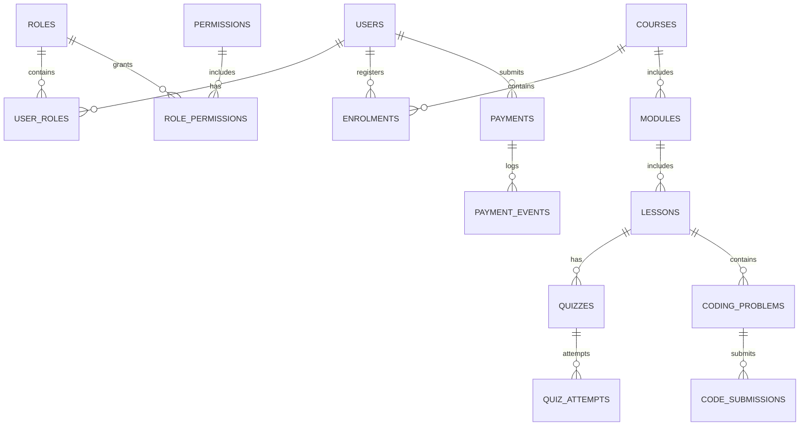

# Database & ERD Documentation - Code Journey Academy

## Entity Relationship Diagram (ERD)

## Database Schema Structure

The platform uses over 35 core normalized tables in PostgreSQL:

1. `users`: Stores student and staff accounts (UUID, arabic_name, phone_number, email, hashed_password, grade_level, status).
2. `roles` & `permissions`: Role-Based Access Control matrix.
3. `courses`, `modules`, `lessons`: Curriculum structure with prerequisites and unlock parameters.
4. `payments` & `payment_events`: Manual payment receipts, reference numbers, InstaPay identifiers, and review drawer audit trails.
5. `enrolments`: Course access records with access start and expiry timestamps.
6. `quizzes`, `questions`, `quiz_attempts`: Server-controlled timed assessments with randomized options and attempt snapshotting.
7. `coding_problems`, `test_cases`, `code_submissions`: Practical challenge statements, hidden/public test cases, and execution run logs.
8. `lesson_progress`, `video_progress`, `course_progress`: Granular tracking of video watch %, theory completion, practical submissions, and quiz scores.
9. `platform_settings`: Dynamic branding (instructor name, contacts, colors, passing scores).
